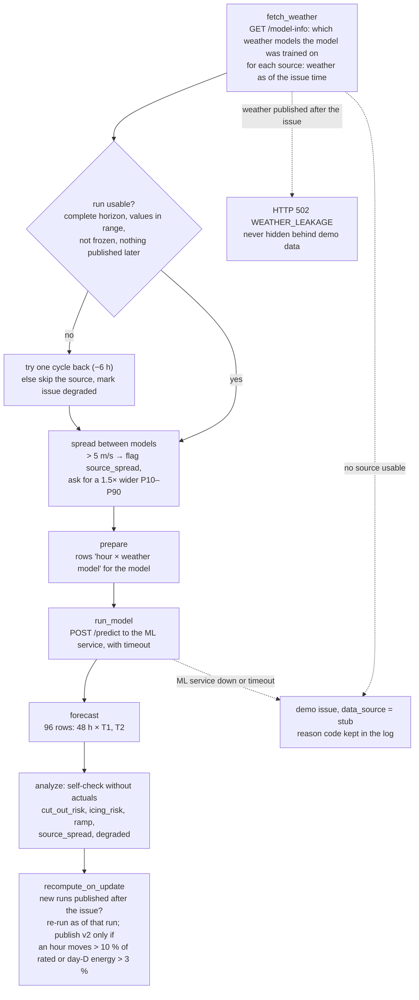
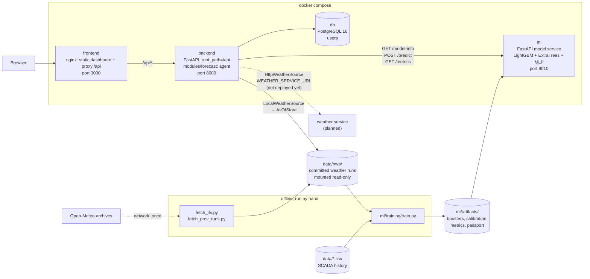

# ZHEL.ai: agentic day-ahead power forecast for the Shelek wind farm

*Zhel* (жел) is Kazakh for "wind".

ZHEL.ai issues an hourly **P10 / P50 / P90** power forecast for the next 48 hours for each
turbine of the Shelek wind farm (2 × Goldwind GW109, 2.5 MW each, Almaty region, Kazakhstan).
An agent runs every issue in a fixed order. It collects the weather forecasts that were
**actually published by the issue time**, runs the model, checks its own output and decides
whether a newer weather run justifies a new version. The whole of February 2026 is replayed
as if each forecast were made on its own day. The stack starts with one command, needs
no API keys, and serves forecasts from weather data committed to the repository.

> [!NOTE]
> **For reviewers: the 3-minute path**
>
> 1. `cp .env.example .env && make demo`, then open http://localhost:3000 and log in as **admin / admin**.
> 2. The **Обзор** (Overview) page shows the 48-hour forecast for the selected issue day,
>    **Агент** (Agent) shows every decision the agent made, and **Бэктест** (Backtest) shows
>    model quality against the baselines. The interface is in Russian because its users are
>    local grid dispatchers. The API and this README are in English.
> 3. Run the [verification script](#2-replay-all-28-february-issues-and-check-the-as-of-rule).
>    It replays all 28 February issues through the API and asserts that no weather published
>    after the issue time reached any forecast.
>
> What works, what is partial and what is not done yet is listed honestly in
> [What is implemented](#what-is-implemented) and [Limitations](#limitations).

**Key numbers.** All come from files in the repository and can be re-checked with the
commands given below.

| | |
|---|---|
| Issues replayed | 28 (31 Jan – 27 Feb 2026), each built from weather available at its own issue time |
| Forecast per issue | 48 hours × 2 turbines = 96 rows of P10 / P50 / P90 |
| Weather models used | 5: ECMWF IFS 9 km, ECMWF IFS 0.25°, GFS, ICON, GEM (Open-Meteo archives) |
| nMAE, lead 1–24 h / 25–48 h | **15.49 % / 17.27 %** of rated power |
| Best baseline (GW109 power curve on forecast wind) | 17.11 % over lead 1–48 h |
| P10–P90 coverage | **80.4 %** (target 80 %) |
| Automated tests | 393 passing (backend 359, ML service 34) |

## Contents

- [What it solves and for whom](#what-it-solves-and-for-whom)
- [What is implemented](#what-is-implemented)
- [How it works](#how-it-works): user flow, [dashboard pages](#dashboard-pages),
  conventions, as-of rules, [agent loop](#the-agent-loop), model
- [Results](#results)
- [Key design decisions](#key-design-decisions)
- [Technologies](#technologies)
- [Architecture](#architecture)
- [Installation and launch](#installation-and-launch)
- [How to test](#how-to-test)
- [Data and integrations](#data-and-integrations)
- [Limitations](#limitations)
- [Deployment](#deployment)
- [Repository map](#repository-map)
- [Team](#team)

## What it solves and for whom

A wind farm has to tell the grid operator in advance how much power it will deliver
tomorrow, hour by hour. A bid that is too high is penalised when the wind does not come.
A bid that is too low leaves money and grid balancing capacity unused. The farm therefore
needs more than a single number per hour: it needs a range and a confidence level.

**Users:**

- **Dispatcher of the wind farm.** Receives the forecast at 07:00 Astana time for the
  next day. The Dispatch page turns the forecast into an hourly bid for a chosen shortfall
  risk. The dispatcher also sees warnings: cut-out risk above 25 m/s, icing risk, sharp
  ramps, and disagreement between weather models.
- **Engineer or analyst.** Sees which weather runs were used, why the agent rejected
  or replaced a source, and how the model scores against simple baselines.

**The hard part of the case** is honesty about time. A February 2026 forecast must not use
February weather observations, reanalysis, or weather runs published after the forecast was
made. It must not use February turbine data either. Most shortcuts leak the future
quietly, so the system is built around one rule: every piece of weather carries the time it
became public, and nothing newer than the issue time reaches the model.

## What is implemented

The case has five mandatory requirements. Status of each, checked on the running stack:

| # | Case requirement | Status | Where |
|---|---|---|---|
| 1 | Model built on history | **Done.** Ensemble of LightGBM, ExtraTrees and MLP trained on 47,757 clean turbine hours. P10/P90 calibrated on archived forecasts. Beats all three baselines. | [ml/](ml/), [ml/training/train.py](ml/training/train.py) |
| 2 | Weather forecasts by coordinates, as available at forecast time | **Done.** 5 weather models from Open-Meteo archives are cached in `data/nwp/`. `AsOfStore` returns only runs published by the issue time. Publication delays are set per source. | [backend/src/forecast/weather/](backend/src/forecast/weather/) |
| 3 | Hourly forecast for 24–48 h | **Done.** Every issue returns hours +1…+48 for T1 and T2 with `p10`, `p50`, `p90`. The ML API also returns the whole station on request. | [ml/src/ml_service/](ml/src/ml_service/) |
| 4 | Agent loop: weather → data → model → forecast → analysis → recompute on update | **Done, with one known bug.** All six steps run and every decision is logged with a reason code. Recompute after a new weather run is implemented but currently falls back to demo data in the full stack, see [Limitations](#limitations). | [backend/src/modules/forecast/orchestrator.py](backend/src/modules/forecast/orchestrator.py) |
| 5 | Retro-simulation of February 2026 | **Partial.** All 28 issues are computed live and as-of their own issue time, on request through the API and the dashboard. A batch `make replay` that writes CSV files to `outputs/` is not built yet. | [backend/src/modules/forecast/router.py](backend/src/modules/forecast/router.py) |

Also in the repository:

- **Web dashboard** with seven pages: Overview, Dispatch, Agent, Backtest, Weather, Model,
  Site. It is static React served by nginx, with no build step, and works offline.
- **Three independent leakage guards**: the weather store, the agent, and the ML service
  each reject weather published after the issue time. Details in [How it works](#how-it-works).
- **Data audits with generated reports**: SCADA cleaning summary, time-zone proof, and a
  comparison of weather models against turbine measurements, in [reports/](reports/).
- **Contracts between services**: [docs/api-contract.md](docs/api-contract.md) for the
  dashboard API and [ml/openapi.json](ml/openapi.json) for the model service. A test fails
  if the OpenAPI file drifts from the code.

## How it works

### Main user flow

1. The user opens the dashboard and logs in. JWT auth, demo account `admin / admin`.
2. The user picks an issue day between 31 Jan and 27 Feb 2026. The dashboard calls
   `GET /api/forecast/{date}`.
3. The backend runs the agent for that day, as described in [The agent loop](#the-agent-loop).
   The agent asks the ML service which weather models the model was trained on, gets those
   models as they were known at 02:00 UTC that day, and sends them to the ML service.
   It then checks the result and returns 96 hourly rows with risk flags.
4. The user reads the result on the seven pages described below. Changing the day reloads
   only what belongs to that day.
5. **Пересчитать** (Recompute) re-runs the agent as if a newer weather run had just
   been published.

### Dashboard pages

Every page answers one question. All numbers on screen come from API responses; the
dashboard computes nothing on its own except summing the two turbines into the station.
The header holds the issue-day picker, a "demo data" banner whenever a response is marked
`stub`, and the logout button.

| Page | Question it answers | What is on it | Data | State |
|---|---|---|---|---|
| **Обзор** (Overview) | How much will the farm produce tomorrow? | Mean station load for day D; hourly chart of P50 with the P10–P90 band and hub-height wind, for 24 or 48 h; hour cards with value and range; the agent's text summary and issue version; weather at the farm point; **CSV download** of the issue (96 rows) | `GET /api/forecast/{date}` | live |
| **Диспетчер** (Dispatch) | How much should we bid for tomorrow? | Risk slider from 10 % (cautious, bid at P10) to 50 % (bid at P50); hourly bid chart against the P10–P90 band; table with expected power, range, bid and shortfall if P10 comes true; day totals: bid and expected MWh | `GET /api/forecast/{date}/dispatch?risk=` | live |
| **Агент** (Agent) | What did the agent do, and why? | Decision log grouped by the six steps, with `as_of`, reason code and explanation for every line; summary of reason codes; issue version; how the as-of guard works; the **Recompute** button | `GET /api/forecast/{date}/agent-log`, `POST /api/forecast/{date}/recompute` | live; recompute see [Limitations](#limitations) |
| **Бэктест** (Backtest) | How accurate is the model? | nMAE and bias per issue day; calendar of issues coloured by nMAE D+1; comparison with the three baselines; error by lead from +1 to +48 h | `GET /api/forecast/backtest`, from the ML service's `GET /metrics` | live: held-out issues of 2024–2026. February 2026 has no actuals. |
| **Погода** (Weather) | Which weather was known at the issue time? | Weather runs and their availability at T; hub-height wind per model and the ensemble with its spread; weight and wind error per source; a note on the Historical Forecast API trap | `GET /api/forecast/{date}/weather` | **demo data**, marked `stub` |
| **Модель** (Model) | How does wind become power? | Power curve learned by the model; feature importance; training and validation scheme | `GET /api/forecast/model`, from the ML service's `GET /model-info` | live |
| **Объект** (Site) | What exactly is being forecast? | Satellite view of the site; coordinates of both turbines and of the weather point; rated power; a forecast chart per turbine | `GET /api/forecast/site` and the forecast | live |

### Forecast conventions

These choices are fixed in code and apply to every issue.

| Convention | Value | Where it is set |
|---|---|---|
| Issue time | **02:00 UTC = 07:00 Astana (UTC+5)** on day D−1, the day before the target day D | `ISSUE_HOUR_UTC` in [backend/src/modules/forecast/config.py](backend/src/modules/forecast/config.py) |
| Horizon | Every hour from **+1 to +48 h** after the issue. Target day D in local time is covered by leads 17–40. Quality is reported separately for leads 1–24 and 25–48. | `HORIZON_HOURS` in the same file |
| Issues | 31 Jan … 27 Feb 2026: 28 issues, target days 1–28 Feb | `FIRST_ISSUE`, `LAST_ISSUE` in the same file |
| Units | Fraction of rated power from 0 to 1, 2.5 MW per turbine. `p10 ≤ p50 ≤ p90` always holds. | [ml/src/ml_service/service.py](ml/src/ml_service/service.py) |
| Turbine data time zone | SCADA timestamps are **UTC+6 for the whole period**, so `time_utc = time_scada − 6 h`. The region's switch to UTC+5 on 1 Mar 2024 is not present in the data. | proof in [reports/tz_check.md](reports/tz_check.md) |

### As-of rules: what the forecast is allowed to see

A weather run counts as available at `run_init_utc + publication delay`, not at its start
time. Delays are deliberately conservative: an hour too many costs a little accuracy,
an hour too few leaks the future.

| Source | Archive | Delay | Newest run a 02:00 UTC issue can use |
|---|---|---|---|
| `ifs`: ECMWF IFS HRES 9 km | Open-Meteo Single Runs | 7 h 30 min | 18z of the previous UTC day, public at 01:30 |
| `ifs025`: ECMWF IFS 0.25° | Open-Meteo Previous Runs | 10 h | 12z of the previous day, public at 22:00 |
| `gfs`: NOAA GFS | Open-Meteo Previous Runs | 7 h | 18z of the previous day, public at 01:00 |
| `icon`: DWD ICON | Open-Meteo Previous Runs | 8 h | 18z of the previous day, public at 02:00 exactly |
| `gem`: ECCC GEM | Open-Meteo Previous Runs | 8 h | 12z of the previous day, public at 20:00 |

The reasoning for every delay is written next to its value in
[backend/src/forecast/weather/sources.py](backend/src/forecast/weather/sources.py).
Further rules:

- **Newest allowed run per hour.** Previous Runs deliver series stitched from several
  runs, so some hours of the horizon come from older runs. If any hour has no allowed
  run at all, the store raises `NoRunAvailable` rather than returning a partial table.
- **Previous Runs mapped to exact runs.** Open-Meteo's `previous_dayN` values are mapped
  back to the run they came from by
  [prev_runs_rule.py](backend/src/forecast/weather/prev_runs_rule.py), and this was
  verified against exact runs. For 3-hourly models (IFS 0.25°, GEM), Open-Meteo
  interpolates the in-between hours, and those hours can contain a newer run. Such hours
  are tagged with the newest run in the interpolation window, so they cannot slip past
  the as-of filter.
- **No observations in the forecast path.** ERA5, Historical Weather and the Historical
  Forecast API are not used to build forecasts. ERA5 appears only in two offline
  diagnostic scripts: the time-zone check and the weather-model comparison.
- **No turbine data in features.** Model inputs are hub-height wind and temperature from
  the weather forecast, plus hour, season and turbine id. SCADA is used only as the
  training target, and as the persistence baseline in evaluation.

### The agent loop

The agent is a deterministic sequence of named steps. The names are the steps listed in
the case brief. The agent does not use an LLM: every decision is a rule, and every rule
leaves a line in the decision log. The log line records what was checked, what was chosen
and why, with a machine-readable reason code.



What happens when something fails:

- **The weather service does not answer.** `WeatherGateway` switches from the HTTP weather
  service to the same cache read in-process (`LocalWeatherSource`) and logs
  `WEATHER_UNAVAILABLE`. The HTTP weather service is not deployed yet, so every issue in
  the current stack goes through this fallback, and the Agent page shows it.
- **A source has no run at issue time.** The agent logs `FALLBACK`, continues with the
  remaining sources and marks the issue `degraded`.
- **The ML service is down or times out.** The issue is built from clearly marked demo
  data (`data_source: "stub"`), and the dashboard shows a "demo data" banner. Real and
  synthetic numbers cannot be confused.
- **Weather from the future appears.** The request fails with `WEATHER_LEAKAGE`. A leak is
  never hidden behind demo data.

Example: the decision log of the 10 Feb 2026 issue, from
`GET /api/forecast/2026-02-10/agent-log`. The API returns the reasons in Russian; here they
are translated and shortened.

```text
fetch_weather        use_model_sources   USE_SOURCE          model was trained on ifs, ifs025, gfs, icon, gem, taking them
fetch_weather        use_spare_weather   WEATHER_UNAVAILABLE weather service did not answer, using the cached runs in the image
fetch_weather        mark_source_spread  VALIDATE_FAIL       sources disagree on wind by 6.4 m/s, threshold 5
prepare              build_features      USE_SOURCE          240 rows 'hour × weather model' go to the model
run_model            call_model_service  USE_SOURCE          P10…P90 interval widened 1.5×: sources disagree
run_model            predict             USE_SOURCE          ensemble-scada-2026-01-31-v2 returned P10/P50/P90 for 48 hours
forecast             publish_version     USE_SOURCE          96 rows for +1…+48 h, 2 turbines
analyze              flag_hours          RISK_FLAGS          checked range, ramps, cut-out, icing: ramp 17 h, source_spread 96 h
recompute_on_update  keep_version        NO_MATERIAL_CHANGE  version 1 published, 18 newer runs expected after issue time
```

### The model

- **P50** is the mean of three models trained on hourly SCADA data: wind and temperature
  as inputs, power as the target. The three are five LightGBM boosters (quantile 0.5,
  different seeds), an ExtraTrees regressor, and an MLP. Features are `ws, t, hour,
  doy_sin, doy_cos, turbine`. They are built by one function,
  [ml/src/ml_service/features.py](ml/src/ml_service/features.py), which serves both
  training and inference. At inference, `ws` and `t` are hub-height wind and 2 m
  temperature averaged across the weather models that arrived.
- **P10 and P90** are P50 plus offsets from a calibration table
  ([ml/artifacts/calibration.json](ml/artifacts/calibration.json)). The offsets were fitted
  on as-of forecasts from training days, bucketed by lead (1–24 / 25–48), forecast level
  and spread between weather models. The interval therefore reflects the error of the
  weather forecast, not only the scatter of the power curve.
- **Why train on SCADA and not on archived forecasts.** SCADA starts in March 2023, and
  the weather archives only in February–March 2024, so SCADA gives more training data.
  In the team's comparison on the same held-out as-of issues, the SCADA-trained model was
  also more accurate than a model trained on archived forecasts. The code of that
  comparison is not in the repository. The gap between measured wind in training and
  forecast wind in operation is covered by the interval calibration, which is fitted on
  real as-of forecasts.
- **Turbines.** One model with a `turbine` feature. T1 and T2 are forecast separately.
  `station` is available from the ML API as the mean of T1 and T2.

## Results

Evaluation: turbine days were split 80/20 at random, as whole days, seed 42. That gives
211 held-out days. On those days the model forecast every issue at 02:00 UTC from weather
**available at that moment**, exactly as in production, and was scored against SCADA.
The scored issues run from February 2024 to January 2026. nMAE is the mean
|P50 − actual| as a percentage of rated power.

| Model, lead 1–48 h unless stated | nMAE, % |
|---|---|
| **ZHEL ensemble, lead 1–24 h** | **15.49** |
| **ZHEL ensemble, lead 25–48 h** | **17.27** |
| ZHEL ensemble, lead 1–48 h (from the 53.0 % skill over persistence) | ≈ 16.4 |
| Baseline: GW109 passport power curve applied to forecast wind | 17.11 |
| Baseline: climatology, month × hour | 31.67 |
| Baseline: persistence (actual power at issue time) | 34.86 |

| Other metrics | Value |
|---|---|
| nRMSE, lead 1–48 h | 24.23 % |
| P10–P90 coverage (share of actual values inside the interval) | 80.4 % |
| nMAE by turbine, lead 1–24 / 25–48 h | T1 15.33 / 17.18, T2 15.63 / 17.36 |

How to read this. The ensemble beats all three baselines. Its edge over the physical power
curve is modest, about 0.7 percentage points. Most of the value is elsewhere: a
**calibrated uncertainty band** (80.4 % coverage for a nominal 80 % band), per-hour risk
flags, and a forecast that stays honest about what was known at issue time. Validation
details and their weak points are listed under [Limitations](#limitations).

Where the numbers live: [ml/artifacts/metrics.json](ml/artifacts/metrics.json), served
as `GET /metrics` by the ML service and as `GET /api/forecast/backtest` by the dashboard.
It also has per-day and per-lead breakdowns. `make ml-train` retrains the model and
rewrites the file in about 30 seconds.

## Key design decisions

Each decision in one line, with the reason and where to find it.

**Time and weather data**

| Decision | Why |
|---|---|
| Availability is counted from the **publication time** of a run, not its start time | A run exists only after it is published. Using the start time would let 7–10 h of the future into every issue. See [sources.py](backend/src/forecast/weather/sources.py). |
| Publication delays are **conservative** | An hour too many costs a little accuracy; an hour too few is a leak. Each value has a written justification next to it. |
| **Five weather models**, averaged into one wind value | In our check against SCADA, the four-model ensemble cut wind error compared with the best single model by 11 % at +24 h and 8 % at +48 h, see [reports/weather_vs_scada.md](reports/weather_vs_scada.md). IFS 9 km was added as the most detailed model. |
| Previous Runs values are **mapped back to their exact run** | `previous_day1` looks like "the forecast from a day ago", but for leads 25–48 it comes from a run published after the issue. Mapping and tagging interpolated hours closes this trap. See [prev_runs_rule.py](backend/src/forecast/weather/prev_runs_rule.py). |
| **Issue at 02:00 UTC, horizon +1…+48 h** | 07:00 Astana on the day before leaves the dispatcher the whole working day to bid for day D. Issuing all 48 hours removes the ambiguity of "24–48 h", and quality is reported for both halves. |
| SCADA time zone **proved, not assumed** | The brief warned about the 1 Mar 2024 switch to UTC+5. Correlating turbine wind with forecasts showed UTC+6 on the whole period, so one fixed shift is applied. See [reports/tz_check.md](reports/tz_check.md). |
| Weather cache **committed** to the repository, with checksums | A reviewer reproduces every forecast without network, keys or API limits, and gets the same bytes we used. |

**Model**

| Decision | Why |
|---|---|
| **Only clean hours** train the model | Hours of downtime, curtailment, icing or a frozen sensor do not describe how wind becomes power. See [scada.py](backend/src/forecast/dataset/scada.py). |
| **P50 trained on SCADA, P10/P90 calibrated on as-of forecasts** | SCADA starts a year before the weather archives, so it gives more data. The error of the weather forecast is then captured where it matters: in the width of the interval. |
| **Three model families** (LightGBM, ExtraTrees, MLP), plain mean | All three score almost the same on held-out forecasts ([ml/artifacts/](ml/artifacts/)). A plain mean has no weights to overfit, and a missing member does not stop the service. |
| **One feature function** for training and inference | Two copies of feature code are the most common cause of train/serve skew. See [features.py](ml/src/ml_service/features.py). |
| **No lags, no SCADA values** in features | There are no February 2026 actuals, so any lag would be a leak. |
| **One model for both turbines**, with a `turbine` feature | The turbines are 340 m apart and behave almost alike; one model uses the data of both. |
| **80/20 split by random whole days** | Weather archives cover only about two years, and a random split keeps both seasons in training and in validation. The cost is somewhat optimistic scores, see [Limitations](#limitations). |

**Agent**

| Decision | Why |
|---|---|
| **Deterministic agent without an LLM** | The same inputs give the same forecast and the same log. It runs without keys, and every decision can be explained by a rule and a reason code. |
| The agent asks the model **which weather models it was trained on** | Training and operation must see the same inputs. The list comes from `GET /model-info`, not from a second copy in the backend. |
| **Spare weather source**: the same cache, read in-process | A failed weather service must not cancel an issue. The switch is always written to the log. |
| **Try one run back** before dropping a source | A broken latest run usually means the previous one is fine; losing a whole model is worse than using a run 6 h older. |
| **Demo data is marked `stub`**, a leak is an **error** | Synthetic and real numbers are never mixed silently. Hiding a leak behind demo data would be worse than failing. |
| **Three leakage guards**: store, agent, ML service | A leak is the most expensive mistake in this case, and each extra check costs almost nothing. |
| **New version only on material change**: an hour moves > 10 % of rated or day-D energy > 3 % | A dispatcher should not have to re-bid for noise from every new run. |

**Engineering**

| Decision | Why |
|---|---|
| **Model as a separate HTTP service** with an OpenAPI contract | LightGBM and its system library stay out of the backend image, and the model can be developed and tested on its own. A test fails if the contract drifts. [ADR 0006](docs/adr/0006-ml-service.md) |
| **Static frontend behind nginx**, no build step | A reviewer needs no Node.js. The UI and the API share one address, so there is no CORS, and the page works offline. [ADR 0007](docs/adr/0007-frontend-as-static-behind-nginx.md) |
| **No state in the backend process** | The decision log, clients and weather store live for one request, so backend replicas are interchangeable. |
| **Forecasts computed on request**, PostgreSQL only for users | Inputs are committed and the pipeline is deterministic, so a stored forecast would only duplicate what can be recomputed in half a second. |
| **One `docker compose` file** as the only entry point | One command starts everything, the same way on every machine. [ADR 0003](docs/adr/0003-single-compose-entrypoint.md) |
| **Tests on in-memory SQLite** | The test suite runs in seconds without Docker. The cost is that PostgreSQL-specific behaviour is not covered. [ADR 0004](docs/adr/0004-sqlite-for-tests.md) |

## Technologies

| Area | Choice |
|---|---|
| Language | Python 3.12 |
| Backend API and agent | FastAPI, Pydantic v2, httpx (clients to other services, with timeouts) |
| Model service | FastAPI, LightGBM, scikit-learn (ExtraTrees, MLP), pandas, numpy |
| Data processing | pandas, numpy |
| Database | PostgreSQL 16 (users and auth), SQLAlchemy 2.0 async, asyncpg, Alembic migrations |
| Auth | JWT (PyJWT), Argon2 password hashing |
| Frontend | React 18 as static files (UMD, no build step), served with the API by nginx |
| Weather data | Open-Meteo **Single Runs** API (ECMWF IFS 9 km) and **Previous Runs** API (IFS 0.25°, GFS, ICON, GEM). Downloaded once into a committed cache. |
| Packaging | uv with lock files, separate projects for `backend/` and `ml/` |
| Quality | Ruff (lint and format), pytest, pre-commit hooks, GitHub Actions workflows |
| Runtime | Docker Compose: `frontend`, `backend`, `ml`, `db` |
| AI in development | Claude Code as the coding agent, see [docs/ai-workflow.md](docs/ai-workflow.md) |
| AI at runtime | The agent is rule-based and deterministic. No LLM is called and no API key is needed. |

## Architecture



- **frontend**: nginx serves the static dashboard and proxies `/api` to the backend.
  Interface and API share one address, so no CORS is needed.
  Decision: [docs/adr/0007](docs/adr/0007-frontend-as-static-behind-nginx.md).
- **backend**: FastAPI. `modules/forecast` holds the agent: orchestrator, clients, analysis
  and decision log. `forecast/weather` and `forecast/dataset` hold the weather store and
  the SCADA loader. `modules/auth` holds users and tokens. Routers contain no logic, and
  no state is kept in the process between requests, so replicas are interchangeable.
- **ml**: a separate service with its own image and lock file, so LightGBM and `libgomp1`
  stay out of the backend image. It loads its artifacts once at start-up. It checks inputs
  itself: rows published after `issue_time_utc` get `422 LEAKAGE_DETECTED`.
  Decision: [docs/adr/0006](docs/adr/0006-ml-service.md).
- **db**: PostgreSQL, used for users only. Forecasts are computed on request and not stored.

Interfaces between the parts:

| Boundary | Contract | Timeout and failure handling |
|---|---|---|
| dashboard → backend | [docs/api-contract.md](docs/api-contract.md), schemas in [backend/src/modules/forecast/schemas.py](backend/src/modules/forecast/schemas.py) | Unified error envelope `{"error": {"code", "message", "details"}}` |
| backend → ml | [ml/openapi.json](ml/openapi.json), Swagger at http://localhost:8010/docs | `ML_SERVICE_TIMEOUT`, failures become `ML_TIMEOUT`, `ML_UNAVAILABLE`, `ML_REJECTED` or `ML_BAD_RESPONSE` |
| backend → weather | `WeatherSource` protocol in [clients/weather.py](backend/src/modules/forecast/clients/weather.py) | `WEATHER_SERVICE_TIMEOUT`, then the in-process fallback |

Who owns which part: [docs/README.md](docs/README.md). Architecture decisions:
[docs/adr/](docs/adr/). Full architecture notes: [docs/ARCHITECTURE.md](docs/ARCHITECTURE.md).

## Installation and launch

**Requirements:** Docker with Compose v2, and free ports 3000, 8000, 8010 and 5432.
Nothing else is needed to run the project. The first build downloads base images and
Python packages. After that the stack runs without network access and without API keys.

```bash
git clone https://github.com/BAITC-Hacks/hack-5e5a1903-mg-ai.git
cd hack-5e5a1903-mg-ai
cp .env.example .env
make demo
```

`make demo` does the following:

1. Builds and starts `db`, `backend`, `ml` and `frontend`.
2. Waits until the database and the backend report healthy.
3. Applies database migrations.
4. Creates the demo user **admin / admin**.

Then open:

| What | URL |
|---|---|
| Dashboard | http://localhost:3000, log in as admin / admin |
| Backend API docs (Swagger) | http://localhost:8000/api/docs |
| ML service docs (Swagger) | http://localhost:8010/docs |

**Without `make`** (for example on Windows), run the same steps directly:

```bash
cp .env.example .env
docker compose up -d --build
docker compose exec backend alembic upgrade head
docker compose exec backend python -m src.scripts.seed
```

If the `alembic` command fails because the backend is still starting, wait until
`docker compose ps` shows `healthy` and run it again.

**Troubleshooting.**

- **A port is busy.** Change `FRONTEND_PORT`, `BACKEND_PORT`, `ML_PORT` or `DB_PORT` in
  `.env` and run `make demo` again. The URL printed at the end of `make demo` does not
  read `.env`, so use the port you set.
- **A service does not become healthy.** Read `docker compose logs backend` or
  `docker compose logs ml`.
- **Stop the stack:** `make down`, or `docker compose down`. Add `-v` to also delete the
  database volume.

## How to test

### 1. Scenario for reviewers, about 3 minutes

The commands assume the default ports from `.env.example`.

```bash
# Health: backend, and the ML service with the trained model loaded
curl -s http://localhost:3000/api/health
# {"status":"healthy","environment":"local","version":"0.1.0"}
curl -s http://localhost:8010/health
# {"status":"ok","model_loaded":true,"model_version":"ensemble-scada-2026-01-31-v2","model_kind":"lightgbm_quantile"}

# Log in and keep the token
TOKEN=$(curl -s -X POST http://localhost:3000/api/auth/login \
  -H 'Content-Type: application/json' -d '{"username":"admin","password":"admin"}' \
  | python3 -c 'import sys, json; print(json.load(sys.stdin)["access_token"])')

# One issue: 96 rows, built live from 5 weather models
curl -s http://localhost:3000/api/forecast/2026-02-10 -H "Authorization: Bearer $TOKEN" \
  | python3 -c 'import sys, json; r = json.load(sys.stdin); print(r["data_source"], len(r["hours"]), r["issue"]["source"]); print(r["summary"])'
# live 96 ifs+ifs025+gfs+icon+gem
# then a text summary in Russian: mean load, peak hour, day-D energy, model, sources, risks

# The agent's decision log for the same issue: step | reason code | reason
curl -s http://localhost:3000/api/forecast/2026-02-10/agent-log -H "Authorization: Bearer $TOKEN" \
  | python3 -c 'import sys, json; [print(d["step"], "|", d["reason_code"], "|", d["reason"][:100]) for d in json.load(sys.stdin)]'

# Model quality against baselines, as shown on the Backtest page
curl -s http://localhost:3000/api/forecast/backtest -H "Authorization: Bearer $TOKEN" \
  | python3 -c 'import sys, json; r = json.load(sys.stdin); print(r["nmae_d1_pct"], r["nmae_d2_pct"], r["coverage_p10_p90_pct"], [b["nmae_pct"] for b in r["baselines"]])'
# 15.49 17.27 80.4 [34.86, 31.67, 17.11]
```

### 2. Replay all 28 February issues and check the as-of rule

This block logs in, requests every issue from 31 Jan to 27 Feb 2026, and asserts four
things for each one:

- the issue was built live, not from demo data;
- it has 96 rows covering leads 1 to 48;
- quantiles are ordered and inside [0, 1];
- **no weather row was published after the issue time**.

It uses only the Python standard library and takes about 15 seconds.

```bash
python3 - <<'EOF'
import json, urllib.request
from datetime import date, timedelta

BASE = "http://localhost:3000/api"

def call(path, body=None, token=None):
    headers = {"Content-Type": "application/json", **({"Authorization": f"Bearer {token}"} if token else {})}
    req = urllib.request.Request(BASE + path, data=json.dumps(body).encode() if body else None, headers=headers)
    return json.load(urllib.request.urlopen(req, timeout=60))

token = call("/auth/login", {"username": "admin", "password": "admin"})["access_token"]
for i in range(28):
    day = date(2026, 1, 31) + timedelta(days=i)
    r = call(f"/forecast/{day}", token=token)
    hours, issue = r["hours"], r["issue"]["issue_time_utc"]
    assert r["data_source"] == "live", (day, r["data_source"])
    assert len(hours) == 96 and {h["lead_h"] for h in hours} == set(range(1, 49))
    assert all(0 <= h["p10"] <= h["p50"] <= h["p90"] <= 1 for h in hours)
    assert all(h["available_at_utc"] <= issue for h in hours)  # as-of: nothing published after the issue time
    latest = max(h["available_at_utc"] for h in hours)
    print(f"{day}  issue {issue}  newest weather published {latest}  day-D energy {r['kpi']['day_energy_mwh']:6.2f} MWh")
print("OK: 28 issues, 96 rows each, P10<=P50<=P90, all weather published before the issue time")
EOF
```

Expected output: 28 lines such as
`2026-02-10  issue 2026-02-10T02:00:00Z  newest weather published 2026-02-10T01:30:00Z  day-D energy  70.83 MWh`,
then the `OK` line.

### 3. See a leak being rejected

The ML service refuses a weather row published after the issue time. Here it is an
IFS 00z run, which becomes public only at 07:30.

```bash
curl -s http://localhost:8010/predict -H 'Content-Type: application/json' -d '{
  "issue_time_utc": "2026-01-31T02:00:00Z", "horizon_hours": 1,
  "rows": [{"valid_time_utc": "2026-01-31T03:00:00Z", "source": "ifs",
            "run_init_utc": "2026-01-31T00:00:00Z", "available_at_utc": "2026-01-31T07:30:00Z",
            "ws100": 8.4, "t2m": -6.1}]}'
# {"error":{"code":"LEAKAGE_DETECTED","message":"...","details":{...}}}
```

Two more negative cases:

- A date outside the simulation, such as `GET /api/forecast/2026-03-15`, returns
  `404 ISSUE_NOT_FOUND`.
- A wrong password returns `401 INVALID_CREDENTIALS`.

### 4. Automated tests and linters

These need [uv](https://docs.astral.sh/uv/). They are the same commands that the GitHub
Actions workflow in [.github/workflows/ci.yml](.github/workflows/ci.yml) runs.

```bash
make install && make test        # backend: 359 tests
make ml-install && make ml-test  # ML service: 34 tests
make lint && make ml-lint        # Ruff lint and format check
```

The tests do not need Docker or network access. They cover:

- the as-of store and leakage errors on a synthetic weather cache;
- the Previous Runs → exact run mapping, including the 3-hourly interpolation case;
- the issue manifest;
- SCADA hourly aggregation and cleaning flags, and the time-zone rule;
- every agent rule and every failure path at the service boundaries, with the
  neighbouring services faked;
- the ML contract, including leakage, horizon and duplicate checks, and each ensemble
  member.

On macOS, LightGBM needs OpenMP for the local ML tests: `brew install libomp`. The Docker
image already includes it.

### 5. Claim → where in code → how to verify

| Claim | Where in code | How to verify |
|---|---|---|
| Only weather published by the issue time is used | [backend/src/forecast/weather/asof.py](backend/src/forecast/weather/asof.py), `AsOfStore.get_nwp`, `check_no_leakage` | [test_asof.py](backend/tests/forecast/test_asof.py); script in step 2 |
| Availability = run start + conservative publication delay | [backend/src/forecast/weather/sources.py](backend/src/forecast/weather/sources.py) | `available_at_utc − run_init_utc` in any forecast row, for example 18z + 7:30 = 01:30 |
| Previous Runs `previous_dayN` do not leak via stitching or interpolation | [backend/src/forecast/weather/prev_runs_rule.py](backend/src/forecast/weather/prev_runs_rule.py) | [test_prevday_mapping.py](backend/tests/forecast/test_prevday_mapping.py), [test_fetch_prev_runs.py](backend/tests/forecast/test_fetch_prev_runs.py) |
| The agent drops late rows again (second guard) | `_drop_leakage` in [orchestrator.py](backend/src/modules/forecast/orchestrator.py) | [test_forecast_gateway.py](backend/tests/test_forecast_gateway.py) |
| The ML service rejects late rows (third guard) | [ml/src/ml_service/frame.py](ml/src/ml_service/frame.py) | step 3 above; [ml/tests/test_api.py](ml/tests/test_api.py) |
| The agent runs the six steps of the brief and logs each decision | [orchestrator.py](backend/src/modules/forecast/orchestrator.py), [decisions.py](backend/src/modules/forecast/decisions.py) | `GET /api/forecast/{date}/agent-log`; the Agent page; [test_forecast_agent.py](backend/tests/test_forecast_agent.py) |
| A failed weather source switches to the spare source, not a crash | `WeatherGateway` in [clients/weather.py](backend/src/modules/forecast/clients/weather.py) | log line `use_spare_weather WEATHER_UNAVAILABLE`; [test_forecast_gateway.py](backend/tests/test_forecast_gateway.py) |
| Self-check without actuals: range, ramps, cut-out, icing, source spread | [backend/src/modules/forecast/analyze.py](backend/src/modules/forecast/analyze.py) | `flags` on every hour; [test_forecast_agent.py](backend/tests/test_forecast_agent.py) |
| One feature function for training and inference, no SCADA in features | [ml/src/ml_service/features.py](ml/src/ml_service/features.py), used by [ml/training/train.py](ml/training/train.py) | `FEATURES` list; `GET /model-info` → `features` |
| P10 / P50 / P90 from an ensemble with a calibrated interval | [ml/src/ml_service/predictors/lgbm.py](ml/src/ml_service/predictors/lgbm.py), [ml/artifacts/calibration.json](ml/artifacts/calibration.json) | [ml/tests/test_lgbm.py](ml/tests/test_lgbm.py); coverage 80.4 % in `metrics.json` |
| Beats climatology, power-curve and persistence baselines | [ml/training/train.py](ml/training/train.py) → [ml/artifacts/metrics.json](ml/artifacts/metrics.json) | `GET /api/forecast/backtest`; `make ml-train` |
| SCADA cleaned: downtime, curtailment, icing, frozen sensor, cut-out | [backend/src/forecast/dataset/scada.py](backend/src/forecast/dataset/scada.py) | [reports/scada_summary.md](reports/scada_summary.md); [test_scada.py](backend/tests/forecast/test_scada.py) |
| SCADA time zone is UTC+6 for the whole period | [backend/src/analysis/tz_check.py](backend/src/analysis/tz_check.py) | [reports/tz_check.md](reports/tz_check.md); `cd backend && uv run python -m src.analysis.tz_check` |
| Calls to other services have timeouts and typed failures | [backend/src/modules/forecast/clients/base.py](backend/src/modules/forecast/clients/base.py) | `ML_SERVICE_TIMEOUT`, `WEATHER_SERVICE_TIMEOUT` in `.env.example`; [test_forecast_gateway.py](backend/tests/test_forecast_gateway.py) |
| Runs without network or keys | committed cache in `data/nwp/`, `./data:/data:ro` in [docker-compose.yml](docker-compose.yml) | Disconnect after the first build and repeat step 2 |

## Data and integrations

**Turbine history (SCADA)**, provided by the organisers:
`data/Dataset HackAlemAI turbine 1.csv` and `… turbine 2.csv`.

- Content: 10-minute records from 11 Mar 2023 to 31 Jan 2026 with mean wind speed,
  normalised active power and ambient temperature.
- Conversion to hourly values: [scada.py](backend/src/forecast/dataset/scada.py). An hour
  counts if it has at least 4 of 6 records.
- Each hour gets at most one flag: `frozen_sensor`, `cut_out`, `icing`, `downtime` or
  `curtailment`.
- Coverage: T1 has 23,728 usable hours (6.6 % missing), T2 has 24,919 (1.9 % missing).
  Details in [reports/scada_summary.md](reports/scada_summary.md).
- The data is mounted read-only and never modified.

**Weather forecasts**, cached in `data/nwp/`. About 5 MB, committed, with `SHA256SUMS`
per source.

| Source | API | Coverage in the cache |
|---|---|---|
| ECMWF IFS HRES 9 km (`ifs`) | Open-Meteo Single Runs, `ecmwf_ifs`, exact runs | 12z and 18z daily from 15 Mar 2024; all four runs from 1 Feb 2026; first 72 h of each run; gaps listed in `data/nwp/ifs/gaps.csv` |
| ECMWF IFS 0.25° (`ifs025`), GFS (`gfs`), ICON (`icon`), GEM (`gem`) | Open-Meteo Previous Runs, `previous_day1…3` | From February–March 2024 to 1 March 2026 |

All sources use the point 43.6442, 78.5372, midway between the two turbines. Variables:
wind at 80 / 100 / 120 m, wind direction at 100 m, gusts, 2 m temperature, humidity and
surface pressure.

**Refreshing the cache is optional** and is the only step that needs network access:

```bash
cd backend
uv run python -m src.forecast.weather.fetch_ifs           # IFS runs, about 1,500 requests, ~20 min
uv run python -m src.forecast.weather.fetch_prev_runs     # IFS 0.25°, GFS, ICON, GEM
```

**Diagnostics only**, not used in forecasts: `data/weather_compare/` holds Previous Runs
series and ERA5 reanalysis. Two report scripts use them:
[reports/weather_vs_scada.md](reports/weather_vs_scada.md) and
[reports/tz_check.md](reports/tz_check.md).

**External services at runtime:** none. No API keys are read by the code. `.env.example`
has empty slots for `OPENAI_API_KEY` and `API_KEY_21ST`, but nothing uses them.

## Limitations

What is not done or not right yet, stated plainly:

1. **No batch replay and no output files.** Forecasts are computed on request through the
   API, deterministically, about 0.5 s per issue. There is no `make replay` command.
   The Overview page can download one issue as CSV (96 rows, local time, without run
   metadata). The following files are not written: `outputs/submission_feb2026.csv`,
   `outputs/forecasts_all.csv`, `agent_log.jsonl`, and a `manifest.json` per issue.
   A manifest builder with leakage checks exists and is tested
   ([manifest.py](backend/src/forecast/weather/manifest.py)), but the agent does not call it yet.
2. **No `make leakcheck`.** Leakage is guarded in code in three layers and covered by tests,
   but there is no single command that scans the whole pipeline.
3. **Recompute after a new weather run falls back to demo data.** This affects
   `POST /api/forecast/{date}/recompute`, the "Пересчитать" button. The agent re-runs
   with knowledge moved to the publication time of the newer run, but keeps
   `issue_time_utc` at 02:00. The ML service correctly treats rows published after
   `issue_time_utc` as a leak and answers `422 LEAKAGE_DETECTED`. The agent then serves
   the demo issue and logs `ML_REJECTED`. Scheduled issues are not affected. The agent
   tests fake the ML service without this check, so the tests do not catch it.
4. **The uncertainty band is often widened twice.** The agent flags `source_spread` when
   the max − min wind across the five models exceeds 5 m/s. It then asks for a 1.5× wider
   band, although the ML calibration already accounts for model spread. With five models
   the flag fires in 22 of 28 February issues, so those bands are wider than the
   calibrated 80 %.
5. **Validation uses random days, not rolling origin.** The 80/20 split by random whole
   days keeps winter and summer in both parts. Neighbouring days are correlated, though,
   so the scores are somewhat optimistic compared with a strictly time-ordered backtest.
   The following are not done: a time-ordered backtest on January 2026, WAPE, and
   backtests on February 2024 and February 2025.
6. **Committed metrics predate two as-of fixes.** `metrics.json` was produced before
   fixes #60 and #62 in the weather store. Retraining on the current code with
   `make ml-train` gives nMAE 15.57 % / 17.28 %, coverage 80.3 % and power-curve
   baseline 17.15 %, which are within 0.1 percentage points of the committed values.
7. **P50 is trained on measured wind.** The model learns the site's power curve from SCADA.
   It does not learn systematic biases of weather forecasts at this site. Only the
   interval is calibrated on forecasts.
8. **The HTTP weather service is not deployed.** The backend reads the same committed cache
   in-process. That is the designed fallback, but it means the primary HTTP path is
   exercised only in tests.
9. **Some dashboard content is synthetic.** The **Погода** (Weather) page is demo data and
   says so (`data_source: "stub"`). The issue picker in the header shows placeholder
   summaries. Forecast, Dispatch, Agent log, Backtest and Model are live. The ML API
   supports a "what if" wind shift (`options.wind_shift_ms`), but the dashboard does
   not use it.
10. **Weather archive assumptions and gaps.**
    - For 2024–2025, IFS 9 km is assumed to have been available as fast as it is today,
      7 h 30 min after the run start. Real-time open publication of IFS 9 km began only
      in October 2025.
    - Before 5 Aug 2024 the archive has no IFS 18z runs, so the older 12z run is used.
    - 4–9 Aug 2025 is damaged in the Open-Meteo archive.
    - January and February 2026 are complete.
    - Details: [docs/dev3/README.md](docs/dev3/README.md).
11. **Demo security.** Login is `admin / admin` by design, so a reviewer can log in
    without setup. Change `SEED_ADMIN_PASSWORD` in `.env` before the first `make demo`
    anywhere else. Refresh tokens are issued but there is no refresh endpoint yet.
    See [SECURITY.md](SECURITY.md).

## Deployment

There is no public deployment. The project runs locally with Docker Compose, as described
in [Installation and launch](#installation-and-launch).

## Repository map

```text
.
├── backend/                      FastAPI backend (Python 3.12, uv)
│   ├── src/modules/forecast/     the agent: orchestrator, clients, analyze, decisions, API router
│   ├── src/forecast/weather/     as-of weather store, source registry, Open-Meteo loaders, manifest
│   ├── src/forecast/dataset/     SCADA loader, hourly aggregation, cleaning flags
│   ├── src/analysis/             offline diagnostics: time-zone check, weather vs SCADA
│   ├── src/modules/auth/         users and JWT auth
│   └── tests/                    359 tests
├── ml/                           model service (own image and lock file)
│   ├── src/ml_service/           API, features, predictors, ensemble members
│   ├── training/                 training scripts for LightGBM, ExtraTrees, MLP
│   ├── artifacts/                trained model, calibration, metrics, passport
│   ├── openapi.json              contract, checked against the code by a test
│   └── tests/                    34 tests
├── frontend/                     static dashboard (React 18, no build step)
├── deploy/nginx/                 nginx config: static files and /api proxy
├── data/                         SCADA history and the committed weather cache (read-only)
├── reports/                      generated data reports
├── docs/                         architecture, API contract, ADRs, team zones, research
├── docker-compose.yml            the single entry point: frontend, backend, ml, db
├── Makefile                      demo, test, lint, ml-train and other commands
└── AGENTS.md                     conventions for AI coding agents working in this repo
```

## Team

Three developers, one zone each. The zones meet only through the contracts listed in
[Architecture](#architecture).

| Role | Zone | Main code |
|---|---|---|
| dev1, Meirzhan | Agent, central backend, dashboard, integration | `backend/src/modules/forecast/`, `frontend/`, `deploy/` |
| dev2, Aibek | Model service: features, training, quantiles, evaluation | `ml/` |
| dev3, Zhanat | Input data: weather archives, as-of store, SCADA, time zone | `backend/src/forecast/`, `backend/src/analysis/`, `reports/` |

How the team worked with AI tools and checked their output:
[docs/ai-workflow.md](docs/ai-workflow.md). Git workflow: [docs/git-workflow.md](docs/git-workflow.md).
