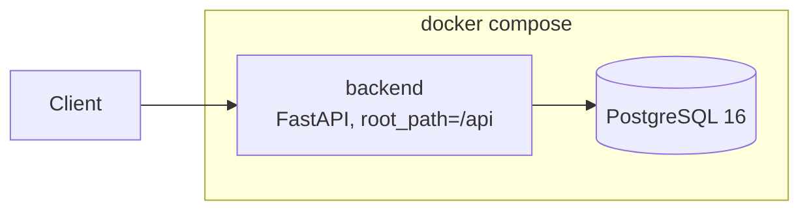

# HackAlem AI

Team project repository for the HackAlem AI hackathon.

This README describes what the repository contains today: a reproducible, tested
backend foundation with JWT authentication, running entirely through Docker Compose.
The case-specific application logic is not implemented yet, and nothing below claims
otherwise.

## What is implemented

- **Authentication API.** Login by email and password, returning an access and a
  refresh token, plus an endpoint that returns the current user with their role.
- **Unified error format.** Every error, including validation errors, is returned as
  `{"error": {"code", "message", "details"}}`. Internal error texts are hidden in the
  `production` environment.
- **Database layer.** Async SQLAlchemy 2.0 over PostgreSQL, with Alembic migrations
  and a shared base model providing `id`, `created_at` and `updated_at`.
- **One-command startup.** A single `docker-compose.yml` builds the backend and starts
  PostgreSQL, with healthchecks on both services.
- **Tests and CI.** 26 tests covering password hashing, token issuing, the
  authentication service, the HTTP layer and the seed script. GitHub Actions runs the
  linter, the formatter check, the tests and a Docker image build on every push and
  pull request.
- **Seed command.** Creates the first administrator, since the API has no public
  registration endpoint.

## How it works

A client sends credentials to `POST /api/auth/login`. The router validates the request
against a Pydantic schema and calls the authentication service. The service looks the
user up, verifies the Argon2 password hash, and rejects the request with the same error
whether the email is unknown or the password is wrong, so the response does not reveal
whether an account exists. On success it issues two JWTs that differ by a `type` claim.
The client then calls `GET /api/auth/me` with the access token; a refresh token is not
accepted there.

## Technologies

| Area | Choice |
|------|--------|
| Language | Python 3.12 |
| Web framework | FastAPI |
| ORM | SQLAlchemy 2.0, async, asyncpg driver |
| Migrations | Alembic |
| Database | PostgreSQL 16 |
| Auth | PyJWT, Argon2 password hashing |
| Packaging | uv |
| Lint and format | Ruff |
| Tests | pytest, pytest-asyncio, httpx |
| Runtime | Docker Compose |
| CI | GitHub Actions |

## Architecture



Inside the backend, a request passes through three layers: the router accepts it and
delegates, the service holds the business logic and database access, and models and
schemas describe the data. Routers contain no logic, and services know nothing about
HTTP. The application is mounted with `root_path="/api"`, so every external path starts
with `/api`.

Full description, diagrams and the decision records behind these choices:
[docs/ARCHITECTURE.md](docs/ARCHITECTURE.md) and [docs/adr/](docs/adr/).

## Installation and launch

Requirements: Docker with Compose. Nothing else needs to be installed to run the project.

```bash
cp .env.example .env
docker compose up -d --build
docker compose exec backend alembic upgrade head
```

The API is then available on the port set by `BACKEND_PORT` in `.env`, which defaults
to 8000. Swagger UI is at `http://localhost:8000/api/docs`.

## How to test the solution

This scenario is reproducible from a fresh clone and takes about a minute.

```bash
# 1. Start the stack and apply migrations
cp .env.example .env
docker compose up -d --build
docker compose exec backend alembic upgrade head

# 2. Create an administrator with a known password
docker compose exec -e SEED_ADMIN_PASSWORD=demo-password-123 \
  backend python -m src.scripts.seed

# 3. Health check
curl http://localhost:8000/api/health
# {"status":"healthy","environment":"local","version":"0.1.0"}

# 4. Log in and capture the access token
curl -s -X POST http://localhost:8000/api/auth/login \
  -H 'Content-Type: application/json' \
  -d '{"email":"admin@hackalem.local","password":"demo-password-123"}'

# 5. Call the protected endpoint with that token
curl http://localhost:8000/api/auth/me -H "Authorization: Bearer <access_token>"
# {"id":1,"email":"admin@hackalem.local","full_name":"Administrator",...}
```

Two negative cases worth checking: a wrong password returns 401 with code
`INVALID_CREDENTIALS`, and passing the refresh token to `/api/auth/me` returns 401
with code `INVALID_TOKEN`.

To run the automated tests, uv is required:

```bash
cd backend && uv sync --dev && uv run pytest
```

## Data and integrations

The project uses no external data sources and calls no third-party APIs at the moment.
All data lives in the project's own PostgreSQL instance. Environment variable slots for
an OpenAI key and a 21st.dev key exist in `.env.example` but are not read by any code
yet, so nothing depends on them.

## Limitations

- The case-specific application logic is not implemented. What exists is the
  foundation described above.
- There is no frontend service in the repository yet.
- There is no refresh endpoint, so a refresh token is issued but cannot be exchanged,
  and tokens cannot be revoked.
- There is no public registration endpoint; the first user is created by the seed script.
- Role checks in `backend/src/core/dependencies.py` come from the upstream template and
  use hardcoded numeric role ids. They are unused and need to be adapted or removed.
- Tests run against in-memory SQLite, so differences between SQLite and PostgreSQL
  dialects are not covered. The reasoning is in
  [docs/adr/0004-sqlite-for-tests.md](docs/adr/0004-sqlite-for-tests.md).
- `Role.user` is declared as a scalar relationship although a role has many users.
  SQLAlchemy warns and silently returns one row.
- The stack runs a single backend instance with no reverse proxy, load balancer or
  cache. The application is written to be stateless so replicas stay interchangeable,
  but none of that infrastructure is set up. Candidates and the reasoning for each are
  listed in [docs/proposals.md](docs/proposals.md), and none of them are installed.
- No deployed version. The project runs locally through Docker Compose.

## Repository guide

- [AGENTS.md](AGENTS.md) — instructions for AI agents: commands, conventions,
  architectural rules.
- [docs/ARCHITECTURE.md](docs/ARCHITECTURE.md) — components and structure.
- [docs/adr/](docs/adr/) — why the main decisions were made this way.
- [docs/ai-workflow.md](docs/ai-workflow.md) — how the team worked with AI tools.
- [SECURITY.md](SECURITY.md) — security measures actually in place.
