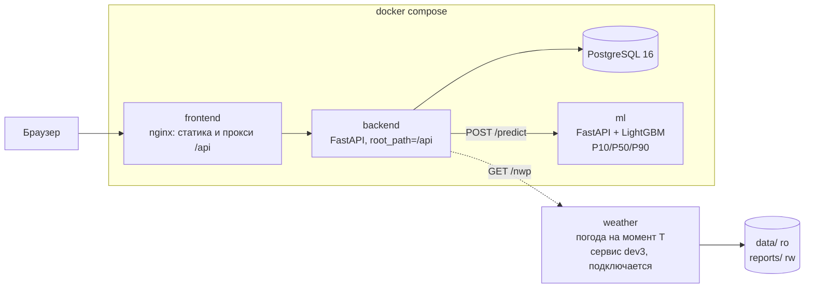
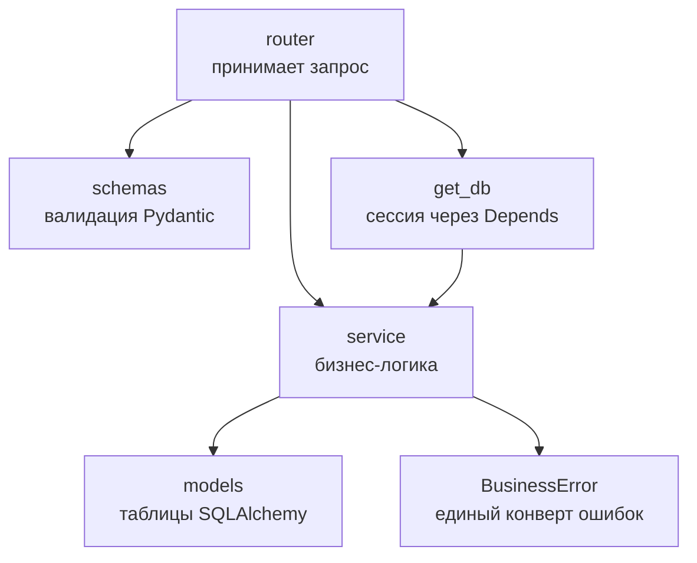

# Архитектура

## Компоненты



Браузер ходит только на `frontend`. nginx раздает статику из `frontend/` и проксирует
`/api` на backend внутри сети compose, поэтому интерфейс и API живут на одном адресе:
CORS не нужен, порт backend в ссылки не попадает. Почему статика, а не сборка фронтенда:
[adr/0007-frontend-as-static-behind-nginx.md](adr/0007-frontend-as-static-behind-nginx.md).

`ml` — модель прогноза за HTTP-контрактом `ml/openapi.json`: принимает прогнозы погоды,
доступные на момент T, и отдает P10/P50/P90. Вызывает ее backend, наружу опубликован
только порт `ML_PORT` для Swagger. Почему отдельный сервис:
[adr/0006-ml-service.md](adr/0006-ml-service.md), эндпоинты: [../ml/README.md](../ml/README.md).

`weather` — сервис dev3 поверх пакета `src/forecast/weather/`. `AsOfStore` внутри него
отдает только те прогоны, которые были опубликованы к моменту прогноза, и бросает
`LeakageError` на попытку взять данные из будущего. Пунктиром он нарисован потому,
что его код еще не влит: в `docker-compose.yml` сервис появится вместе с ним.

## Внутреннее устройство backend



Правило слоев: роутер не содержит логики, сервис не знает про HTTP. Ошибки бросаются
только через `BusinessError`, иначе ответ не попадет в общий формат.

## Стек

| Слой | Технология | Где |
|------|-----------|-----|
| Frontend | React как статика, без сборки; раздает nginx | `frontend/` |
| Backend | FastAPI, SQLAlchemy 2.0 async, Alembic | `backend/` |
| ML-сервис | FastAPI, LightGBM, pandas; контракт `ml/openapi.json` | `ml/`, сервис `ml` в compose |
| БД | PostgreSQL 16 | сервис `db` в compose |
| Пакеты Python | uv | `backend/pyproject.toml`, `backend/uv.lock`; `ml/pyproject.toml`, `ml/uv.lock` |
| Линтер и формат | Ruff | конфиг в `backend/pyproject.toml` и `ml/pyproject.toml` |
| Тесты | pytest, pytest-asyncio, httpx | `backend/tests/`, `ml/tests/` |
| Запуск | Docker Compose | `docker-compose.yml` |
| CI | GitHub Actions | `.github/workflows/ci.yml` |

## Структура репозитория

```
HACKALEM AI/
├── AGENTS.md                # инструкции для ИИ-агентов
├── CLAUDE.md                # ссылки на документацию для Claude Code
├── README.md                # описание проекта для судей, на английском
├── SECURITY.md              # принятые меры безопасности
├── Makefile                 # install / hooks / run / test / lint / audit / migrate
├── docker-compose.yml       # единственная точка запуска
├── docker-compose.dev.yml   # оверлей с автоперезагрузкой
├── .env.example             # все переменные окружения без значений
├── .pre-commit-config.yaml  # хуки, включая запрет коммита в main
├── .github/
│   ├── workflows/ci.yml     # линтер, формат, тесты, сборка образа
│   ├── workflows/audit.yml  # уязвимости в зависимостях, на каждый PR
│   └── pull_request_template.md
├── scripts/
│   ├── no-push-to-main.sh   # хук pre-push, запрещает push в main
│   ├── protect-main.sh      # включает защиту ветки main на GitHub
│   └── audit-deps.sh        # pip-audit и npm audit
├── rules/                   # PDF организаторов и выжимка из них
├── data/                    # исходные данные SCADA, монтируются только на чтение
├── frontend/                # интерфейс: статика дашборда
├── deploy/nginx/            # конфиг nginx: раздача статики и прокси /api
├── ml/                      # ML-сервис dev2: контракт, модель, артефакты
├── outputs/                 # пустой каталог под выгрузки, пока ничем не заполняется
├── reports/                 # материалы анализа данных, например сравнение моделей погоды
├── docs/
│   ├── ARCHITECTURE.md      # этот файл
│   ├── architecture-guidelines.md  # best practices
│   ├── proposals.md         # инструменты на будущее, не внедрены
│   ├── backend.md           # разбор backend и его шаблона
│   ├── git-workflow.md      # ветки, коммиты, PR, запрет прямого push в main
│   ├── dependency-audit.md  # проверка зависимостей перед мерджем
│   ├── worktrees.md         # worktree на фичу и слоты портов
│   ├── ai-workflow.md       # как команда работала с ИИ
│   ├── pre-submit-checklist.md
│   ├── adr/                 # записи об архитектурных решениях
│   └── dev1/ dev2/ dev3/    # зоны ответственности разработчиков
├── .dev-notes/              # заметки команды, me.md определяет кто ты
├── backend/
│   ├── src/core/            # config, database, security, exceptions, logger
│   ├── src/modules/auth/    # образцовый модуль
│   ├── migrations/          # Alembic
│   └── tests/               # pytest
└── ml/                      # ML-сервис: FastAPI + LightGBM, свой uv.lock
    ├── src/ml_service/      # схемы контракта, подготовка входа, модели
    ├── artifacts/           # обученная модель, паспорт, бэктест
    ├── openapi.json         # контракт, генерируется из схем
    └── tests/               # pytest
```

## Правила и то, чего здесь пока нет

Правила, по которым эта архитектура растет, лежат в
[architecture-guidelines.md](architecture-guidelines.md). Ключевое из них: backend
не хранит состояние в памяти процесса, поэтому реплики взаимозаменяемы и приложение
готово к балансировке нагрузки.

Инструменты, которые хорошо подошли бы дальше, собраны в [proposals.md](proposals.md)
вместе с оценкой, когда они понадобятся. Среди них обратный прокси и балансировка
на nginx, Redis, фоновый воркер, объектное хранилище и pgvector. **Ничего из этого
в проекте нет**, и добавляется оно только по решению команды.

## Решения и почему так

Каждое значимое решение зафиксировано отдельной записью в [adr/](adr/):

- [0001](adr/0001-fastapi-template-as-base.md) — взять готовый FastAPI-шаблон за основу.
- [0002](adr/0002-worktree-per-feature.md) — worktree на фичу со слотами портов.
- [0003](adr/0003-single-compose-entrypoint.md) — один compose-файл в корне как точка запуска.
- [0004](adr/0004-sqlite-for-tests.md) — тесты на SQLite в памяти, а приложение на PostgreSQL.
- [0005](adr/0005-ml-stack.md) — pandas, scikit-learn и httpx в backend.
- [0006](adr/0006-ml-service.md) — модель прогноза отдельным сервисом `ml` на LightGBM с HTTP-контрактом.

## Запуск

```bash
cp .env.example .env
make demo
```

`make demo` поднимает стек, дожидается готовности базы и backend, накатывает миграции
и создает администратора `admin` с паролем `admin`. После этого интерфейс открывается
на `FRONTEND_PORT` из `.env`, а API доступно по тому же адресу с префиксом `/api`.

Пошагово то же самое без `make`:

```bash
cp .env.example .env
docker compose up -d --build
docker compose exec backend alembic upgrade head
docker compose exec backend python -m src.scripts.seed
curl http://localhost:3000/api/health
```

Порты берутся из `.env`. Если 3000, 8000 или 8010 на машине заняты, слот меняется,
см. [worktrees.md](worktrees.md).

Каталоги `outputs/` и `reports/` лежат в репозитории с файлом `.gitkeep`. Это не
формальность: контейнеры работают от пользователя с uid 1000, а бинд-маунт, которого
нет на хосте, Docker создает от root, и запись из контейнера после этого падает.
