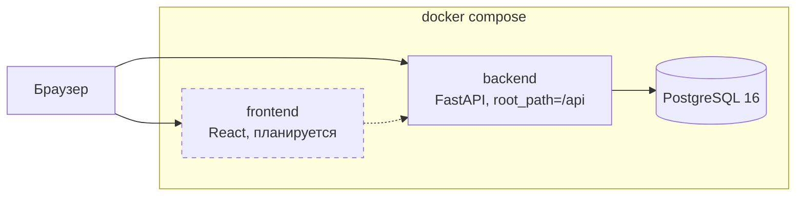
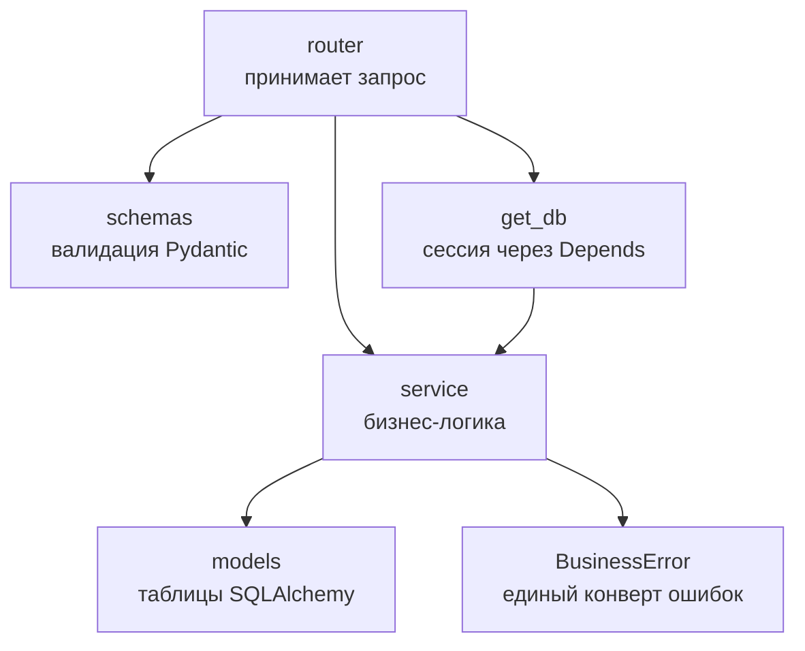

# Архитектура

## Компоненты



Пунктиром обозначен сервис, которого в репозитории еще нет. Сейчас реально работают
`backend` и `db`, оба описаны в `docker-compose.yml`.

## Внутреннее устройство backend



Правило слоев: роутер не содержит логики, сервис не знает про HTTP. Ошибки бросаются
только через `BusinessError`, иначе ответ не попадет в общий формат.

## Стек

| Слой | Технология | Где |
|------|-----------|-----|
| Frontend | React, планируется | `frontend/` |
| Backend | FastAPI, SQLAlchemy 2.0 async, Alembic | `backend/` |
| БД | PostgreSQL 16 | сервис `db` в compose |
| Пакеты Python | uv | `backend/pyproject.toml`, `backend/uv.lock` |
| Линтер и формат | Ruff | конфиг в `backend/pyproject.toml` |
| Тесты | pytest, pytest-asyncio, httpx | `backend/tests/` |
| Запуск | Docker Compose | `docker-compose.yml` |
| CI | GitHub Actions | `.github/workflows/ci.yml` |

## Структура репозитория

```
HACKALEM AI/
├── AGENTS.md                # инструкции для ИИ-агентов
├── CLAUDE.md                # ссылки на документацию для Claude Code
├── README.md                # описание проекта для судей, на английском
├── SECURITY.md              # принятые меры безопасности
├── Makefile                 # install / hooks / run / test / lint / audit / migrate
├── docker-compose.yml       # единственная точка запуска
├── docker-compose.dev.yml   # оверлей с автоперезагрузкой
├── .env.example             # все переменные окружения без значений
├── .pre-commit-config.yaml  # хуки, включая запрет коммита в main
├── .github/
│   ├── workflows/ci.yml     # линтер, формат, тесты, сборка образа
│   ├── workflows/audit.yml  # уязвимости в зависимостях, на каждый PR
│   └── pull_request_template.md
├── scripts/
│   ├── no-push-to-main.sh   # хук pre-push, запрещает push в main
│   ├── protect-main.sh      # включает защиту ветки main на GitHub
│   └── audit-deps.sh        # pip-audit и npm audit
├── rules/                   # PDF организаторов и выжимка из них
├── docs/
│   ├── ARCHITECTURE.md      # этот файл
│   ├── architecture-guidelines.md  # best practices
│   ├── proposals.md         # инструменты на будущее, не внедрены
│   ├── backend.md           # разбор backend и его шаблона
│   ├── git-workflow.md      # ветки, коммиты, PR, запрет прямого push в main
│   ├── dependency-audit.md  # проверка зависимостей перед мерджем
│   ├── worktrees.md         # worktree на фичу и слоты портов
│   ├── ai-workflow.md       # как команда работала с ИИ
│   ├── pre-submit-checklist.md
│   ├── adr/                 # записи об архитектурных решениях
│   └── dev1/ dev2/ dev3/    # зоны ответственности разработчиков
├── .dev-notes/              # заметки команды, me.md определяет кто ты
└── backend/
    ├── src/core/            # config, database, security, exceptions, logger
    ├── src/modules/auth/    # образцовый модуль
    ├── migrations/          # Alembic
    └── tests/               # pytest
```

## Правила и то, чего здесь пока нет

Правила, по которым эта архитектура растет, лежат в
[architecture-guidelines.md](architecture-guidelines.md). Ключевое из них: backend
не хранит состояние в памяти процесса, поэтому реплики взаимозаменяемы и приложение
готово к балансировке нагрузки.

Инструменты, которые хорошо подошли бы дальше, собраны в [proposals.md](proposals.md)
вместе с оценкой, когда они понадобятся. Среди них обратный прокси и балансировка
на nginx, Redis, фоновый воркер, объектное хранилище и pgvector. **Ничего из этого
в проекте нет**, и добавляется оно только по решению команды.

## Решения и почему так

Каждое значимое решение зафиксировано отдельной записью в [adr/](adr/):

- [0001](adr/0001-fastapi-template-as-base.md) — взять готовый FastAPI-шаблон за основу.
- [0002](adr/0002-worktree-per-feature.md) — worktree на фичу со слотами портов.
- [0003](adr/0003-single-compose-entrypoint.md) — один compose-файл в корне как точка запуска.
- [0004](adr/0004-sqlite-for-tests.md) — тесты на SQLite в памяти, а приложение на PostgreSQL.

## Запуск

```bash
cp .env.example .env
docker compose up -d --build
docker compose exec backend alembic upgrade head
curl http://localhost:8000/api/health
```

Порты берутся из `.env`. Если 8000 или 3000 на машине заняты, слот меняется,
см. [worktrees.md](worktrees.md).
